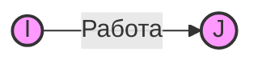
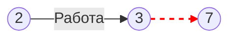
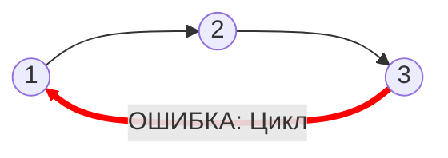
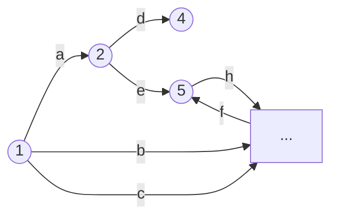
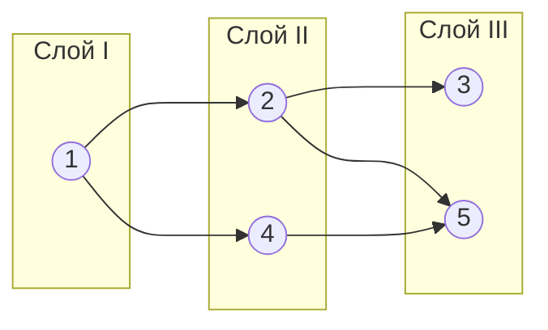
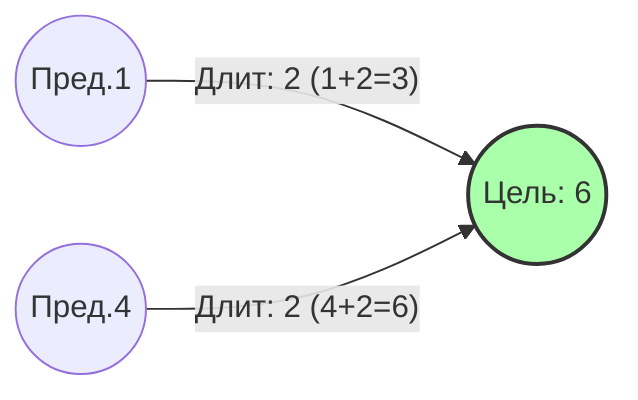
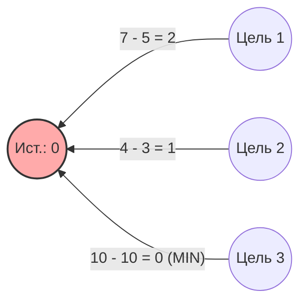

# Лекция 1: Сетевые информационные технологии и анализ проектов

**Теги:** #Сетевые_технологии #Управление_проектами #CPM #Сетевой_график #Диаграмма_Ганта #НРВС #НПДС #Критический_путь
**Лектор:** (Лектор:: Преподаватель)
**Источник:** (Источник:: ЛК1_Сетевые_информационные_технологии_21_02_2026.txt)

---

### Организационные моменты и настройка

Спасибо. Спасибо. Спасибо. Спасибо. Спасибо. Спасибо. Спасибо. Спасибо. Спасибо. Спасибо. 

Так, ладно, сейчас я, наверное, не окошко сделаю. Сейчас. А, я понял. Что делать? Рассказываю, пытаюсь обратную связь получить. Все молчат. Это я немножко не так настроил сейчас. Оказывается, отдельно нужно демонстрацию делать, окна с презентацией отдельно. Ладно, давайте весь экран. Возможно, еще у Яндекс.Телемост просит доступ к устройствам при подключении демонстрации. Может быть.

> **Студент:** Так, сейчас видна демонстрация? Все хорошо?
> **Преподаватель:** Да, видно и слышно.

Ладно, еще разок. Так, значит, те задачи, которые мы с вами решаем. Сетевой анализ проектов, соответственно, тематика, которая будет отражена в ваших индивидуальных работах, которые вы будете выполнять. Сейчас я немножко расскажу теорию, которую как раз вы будете поддерживать с точки зрения выполнения ваших практических задач. То есть те знания, которые вы будете здесь усваивать теоретически, вы их будете и в рамках ваших практических работ закреплять.

---

### Основные задачи сетевого анализа

Сейчас основные задачи, которые решаются:

1.  **Предварительное планирование проектов, прогнозирование нахождения узких мест.**
    Ну, что такое узкие места, *bottlenecks*, я думаю, вы знаете. Мы пытаемся понять, какие работы у нас наиболее критические, соответственно, длительность выполнения которых влияет на длительность выполнения всего проекта. Соответственно, если у нас будут где-то задержки на этих работах по времени, то это отразится на весь проект целиком.
2.  **Планирование завершения работ с целью, возможно, более раннего окончания всего проекта.**
    То есть как распределить ресурсы таким образом, чтобы завершить проект как можно раньше. Тоже такая классическая задача, которая соответствует выполнению проектов, в частности, проектов в программной инженерии.
3.  **Определение последовательности сроков использования ресурсов в течение всего периода выполнения работы проекта.**
    Оптимальное распределение этих ресурсов и поиск, анализ компромиссов между сроками и затратами с учетом имеющихся резервов.

Много всяких книг на эту тему. На самом деле здесь математика. Математика с годами не стареет, соответственно, у нас большой объем книг, к которому вы можете обращаться. Ну, в частности, можно пользоваться тем учебником, который я вам рекомендовал.

---

### Требования к работам проекта

**Проект** – это упорядоченная последовательность заданий или работ. Они упорядочены по времени. Проект может считаться выполненным тогда и только тогда, когда выполнены все работы, в него входящие. Это логично. Я думаю, что какая-то из работ, если не выполнена, то мы считаем, что проект не завершен. Например, если не поклеены обои у вас в комнате, то вы не считаете, что ремонт в вашей комнате завершен.

С точки зрения продолжительности работы могут быть заданы различными способами:
1.  **Детерминированно:** Один, два, три, пять дней.
2.  **Стохастически:** С вероятностью 0,95 эту работу реально завершить за одну неделю.
3.  **Интервально:** Длительность работы будет от трех до пяти дней.

> **Преподаватель:** Это понятно?
> **Студент:** Да.
> **Преподаватель:** Отлично.

Работа выполняется без перерывов до полного завершения. Но это вот в рамках своей математической модели, которую мы будем с вами разбирать. Такое упрощение.

**Ограничения:**
*   Следующая работа не может начаться раньше, пока не будут выполнены все ей предшествующие. Ну, пример из жизни: пока у вас нет стяжки на полу, вы не можете положить линолеум. Пока у вас нет исходных данных, вы не можете начать их обработку. Ну и так далее.
*   Следующая работа не обязательно начинается сразу, как только выполняется ей предшествующая. У вас может быть **резерв времени**. То есть вы можете ресурсы с этой работы высвободить и направить на какую-то другую работу на определенный срок. Но в этом и заключается оптимизация. То есть чем у вас больше свободных резервов, тем больше вариантов их распределения для выполнения проекта.

---

### Построение сети проекта (Модель "Дуга-Работа")

Первая часть нашей с вами работы – это построение сети проекта в рамках модели дуга-работа. То есть у вас там, по-моему, первое задание связано с тем, что нужно построить граф теми методами, способами, про которые я сейчас вам расскажу.

Ну, начинаем с самого банального, простого случая. То есть у нас есть работа.
*   **Работа** у нас отображена дугой.
*   Есть у нас два узла: Узел $I$ и узел $J$.
*   Каждой дуге графа соответствует работа. А узлам графа соответствует событие.
    *   **Событие $I$** – это событие начала работы.
    *   **Событие $J$** – это событие завершения работы.

> **Преподаватель:** Это понятно?
> **Студент:** Да, понятно.
> **Преподаватель:** Отлично.

Между некоторыми событиями можно определить **отношения предшествования**, которые упорядочивают их по времени. Это отношение является **транзитивным**. То есть если $I$ предшествует $J$, и $J$ предшествует $K$, то и $I$ предшествует $K$. Вспоминайте математику 7-8 класса, отношение транзитивности. Оно вполне логичное. Думаю, что не должно у вас вызывать сомнений.

Что значит отношение предшествования? Это значит, что следующую работу нельзя начать, пока не будет завершена предыдущая. Грубо говоря, пока у вас нет дверного проема, вы не можете установить дверь.

В литературе встречаются эквивалентные понятия: Граф, сетевой граф, сеть работ, сеть – это все чаще всего одно и то же. Именно в рамках теории, которую мы с вами рассматриваем.

#### Правила построения графа

Есть перечень правил для модели, в соответствии с которым нужно этот проект строить.

1.  **В графе работ проекта не должно быть тупиковых событий**, то есть таких, из которых не выходит ни одна работа, за исключением завершающего события.
    *   Видите, что у нас третья вершина ни с кем не соединена. В этом случае, а такие будут специально в случае внедрены в ваше задание, то есть у вас исходные данные специально с некоторыми такими неточностями, ошибками, чтобы эти моменты могли исправить, понять. Соответственно, здесь вам нужно троечку соединить с семерочкой. Почему? Потому что семерка – это у нас завершение всего проекта целиком. Соответственно, если у нас третье событие ни с чем не связано, то нужно его соединить с окончательной вершиной, с конечной вершиной. Грубо говоря, что работа 2-3 нужна для того, чтобы завершить проект. Соответственно, 3 мы соединяем с семеркой.

> **Преподаватель:** Здесь вопросов нет?
> **Студент:** А на графах как-то отмечаются те точки, которые являются у нас финальными, заключающими?
> **Преподаватель:** Ну, смотрите, можно на графах вместо единички поставить буковку **N** (начало), а вместо конечной буковку **K**. Мы такую с вами нотацию будем дальше использовать. Пока до упрощения я об этом не говорю, но дальше мы будем именно так и делать.
> **Студент:** Понял, тогда вопросов нет.
> **Преподаватель:** Отлично.

Рисовать вы это все можете руками, можете там в Visio рисовать. Как вам удобнее на самом деле? Здесь я вас никак не ограничиваю. Важно, чтобы вы поняли суть. На самом деле вот эти вот все методы, про которые мы с вами говорим, на них основаны все системы управления проектами. То есть там внутри того же MS Project, вот эти вот все модельки есть. Мы сейчас с вами говорим о модели **дуга-работа**, а еще есть модель **узел-работа**. Вот дуга-работа, она чаще используется именно для того, чтобы руками что-то рассчитывать, а узел-работа для того, чтобы это все программировать, запрограммировать. Ну вот, к узлу работы мы тоже подойдем. Сейчас мы начинаем с вами с дуга-работы модели.

2.  **В графе работ проекта не должно быть хвостовых событий, кроме исходного**, то есть таких, которым не предшествует хотя бы одна работа или события.
    *   Видите, что у нас тут тройка ни с кем не соединена, по аналогии с предыдущим случаем мы соединяем с единицей. То есть если никакое событие не предшествует текущему, то значит мы считаем, что ему предшествует событие начала проекта. Ну, логика тоже есть. Вот, безусловно. Соответственно, мы вот эти все правила используем для того, чтобы те методы, про которые мы дальше будем говорить, их можно было справедливо реализовывать. Поэтому это как бы, если у вас не так, как написано в этих правилах, нужно привести, чтобы было так, как написано в этих правилах, а дальше использовать ту методику, которую мы обсудим.

3.  **В графе работ проекта не должно быть замкнутых контуров (циклов), петель, путей**, соединяющих некоторые события с ними же самими.
    *   Вы видите, да, что у вас тут цикл 1, 2, 3, непонятно кто там, первый, второй, третий. Соответственно, в таком случае мы разрываем этот цикл, то есть одну из дуг мы уничтожаем, чтобы у нас не было циклов, петель, путей и так далее.

4.  **Любые два события должны быть непосредственно связаны не более чем одной работой и стрелкой.**
    *   Это тоже важное такое условие, часто ребята путаются в этом плане. То есть у вас между событиями должна быть только одна работа.
    *   Что делать, если логически кажется, что должно быть две работы? Ну, на самом деле, здесь всегда можно добавить дополнительное событие. Вы всегда в любом проекте можете увеличить масштаб времени, и у вас появятся какие-то дополнительные события между определенными моментами времени. Понимаете, о чем я говорю, да? Если мы какие-то события откладываем на оси с точностью до секунды, то в реальной жизни, да, увеличив масштаб до миллисекунд, то у нас все равно какое-то из событий будет раньше выполняться, какое-то позже. То есть только недостаток масштаба может нам показывать, что эти события, они одновременны. Только когда мы увеличиваем масштаб по времени, то этот процесс... В общем, всегда можно сделать так, что у нас два события будут соединены только одной дугой. То есть этой работой с стрелкой.

> **Преподаватель:** Этот момент ясен, или я несумбурно объяснил как-то?
> **Студент:** Ну, в принципе, понятно. То есть надо... Если получилась такая схема, то нужно увеличить масштаб, чтобы понять, что все-таки они идут последовательно.
> **Преподаватель:** Да, просто еще одни события докидываете, да и все. То есть просто в голове держите, что еще дополнительные события вы формируете. То есть у вас просто будет больше узлов в вашем графе и все. Ну, вы начнете строить. Почему я как бы именно хочу параллельно этот процесс развести лекции с практикой, чтобы когда вы начнете... Сначала становится все вроде ясно, все понятно. Когда начинаешь уже строить все руками, то возникает вопрос. Поэтому я хочу, чтобы как раз вы, получив определенную долю теоретического материала, перешли к практике, ну и задали вопросы, если в этом будет необходимость.
> **Студент:** Хорошо.

5.  **В графе работ проекта рекомендуется иметь одно исходное и одно завершающее событие.**
    *   Ну вот, если этого события, соответственно, нет исходного и завершающего, можно их добавить. То есть можно там либо N, K обозначить (начало и конец), либо еще как-то какими-то идентификаторами. И, соответственно, соединить их **фиктивными работами**.
    *   **Фиктивные работы** – это работы, имеющие нулевую длительность. Они обозначаются не с начала, а с конца алфавита. Но вот здесь на этой схеме вы видите такие пунктирные стрелочки. Вот они как раз нужны для того, чтобы отобразить логику. Но фактически это работа, которая выполняется мгновенно. То есть они имеют нулевую длину. Такая абстракция.

---

### Анализ графа (Пример)

Дальше рассматриваем пример графа. То есть вот такие вот графы вы будете строить, похожие. Здесь мы видим работы: $a, b, c, d, e, f, h$ и так далее. Латинские маленькие буквы. На самом деле идентификаторы можно выбирать произвольным образом. Русские, латинские буквы. Большие, маленькие. Это на самом деле для наших идей не принципиально. Ну и соответственно у нас есть узлы. И узлы имеют номера. Цифры там 1, 2, 3, 4, 5 и так далее.

Что я могу увидеть по этому графу?
*   Я, например, вижу, что работе $d$ предшествует работа $a$.
*   Или, например, что работа $a$ предшествует работе $e$. То есть я понимаю, что для того, чтобы начать выполнять работы $d$ и $e$, я сначала должен выполнить работу $a$.
*   Ну, например, опять же я вижу, что работе $h$ предшествуют работы $e$ и $f$. Ну и так далее.

То есть построив такой граф, я примерно могу представлять себе весь проект целиком. И видеть динамику проекта. Я, например, когда ремонт делал в квартире, я тоже такой вот граф проекта реализовал, построил и вычеркивал те работы, которые уже выполнены. Ну и чтобы ничего не забыть, что перед чем идет. Соответственно, такой граф у меня был, ну, наверное, вершин на 40, на 50. У меня такой крупный ремонт был. Чтобы что-то потом не пришлось переделывать, ничего не забыть. Вот такой вот граф мне помог это все удобно визуализировать, держать в голове и контролировать эти все процессы.

**События** – это начало выполнения работ нескольких и одной. Соответственно, есть события окончания.
*   Событие 2 – это начало выполнения работ $d$ и $e$. И событие 2 же является окончанием выполнения работы $a$.
*   Событие 1 является началом выполнения работ $a, b$ и $c$.
*   Событие 8 является окончанием выполнения работ $k, i, m$.
*   Ну и так далее.

Значит, в вашем варианте у вас будет вот такая вот табличка, где будет перечень работ и перечень предшествующих работ. И вам по этой табличке нужно будет построить граф. Нужно будет задать множество всех путей проекта. По дугам, по вершинам.

Ну, что такое пути в графе, это вы знаете, правильно?
> **Студент:** Да, да, конечно.
> **Преподаватель:** Отлично.

Ну и, соответственно, граф строится справа налево в обратном порядке. Это вы когда будете строить, поймете, что так удобнее. Что вы с конца его строите в начало. То есть, сначала берете конечную вершину, там ставите букву K и там идентификаторы работ. Смотрите, какие самые последние. И потом, в соответствии с отношением предшествования, вы будете формировать граф. Ну, тут надо руками поделать. Тогда в голове все выстроится. Есть такой опыт, который на кончике пальцев формируется. Кажется, что ерунда, вообще все понятно. Но когда вы начнете строить, вопросы появятся. Ну, я не скажу, что это какие-то сложные задания. Я их специально достаточно примитивными делал и по размерности, и по сложности. Просто, чтобы вы поняли, как это все строить.

---

### Упорядочение сетевого графа (Разбиение по слоям)

Основные принципы. Упорядочение сетевого графа заключается в таком расположении событий работ, при котором для любой работы предшествующие события расположены левее и имеют меньший номер по сравнению с завершающим эту работу событием.

Разобьем условно сетевой граф на несколько вертикальных слоев, обведем их пунктирными линиями, обозначим римскими цифрами:
1.  Поместив в первом слое начальное событие $I$ (это единичку).
2.  Мысленно вычеркнем из графа это событие, все входящие в него работы стрелки.
3.  Когда из входящих стрелок останутся события 2 и 4, образующие второй слой.
4.  Вычеркнув мысленно события 2 и 4, все выходящие из них работы, увидим, что без входящих стрелок остаются события 3 и 5 и так далее.

На примере вот такой вот у вас получается граф, он становится растянутым по оси Х. То есть в чем основной принцип вот этого вот разложения его по слоям, упорядочения графа? У вас в слое не должно быть двух узлов, соединенных одной вершиной, той же дугой. То есть я смотрю, что вот в первом слое у меня помещается только узел 1. Дальше, соответственно, во втором слое я помещаю узел 2 и уже сюда не могу поместить узел 3, иначе у меня работой $f$ будет соединен и второй, и третий узел. То есть у меня будет два узла внутри слоя, которые соединены работой.

> **Преподаватель:** Понятно это?
> **Студент:** Лишь вопрос, а зачем так разделять, растягивать по оси Х?
> **Преподаватель:** Для того, чтобы было удобно этот граф анализировать. Потому что здесь вы анализируете это все как бы глазами, мы это все делаем руками, поэтому удобно граф таким образом растянуть, вам там дальше будет проще считать кучу всяких параметров, о которых мы будем дальше говорить.
> **Студент:** Понял. Ну да, я в принципе так и думал. Спасибо.
> **Преподаватель:** Пожалуйста.

---

### Диаграмма Ганта

Дальше следующий тоже такой абстрактный вариант представления проекта, с которым, я надеюсь, вы там все уже знакомы в вашей жизни профессиональной, это **диаграмма Ганта**.

```mermaid
gantt
    title Пример Диаграммы Ганта
    dateFormat DD
    axisFormat %d
    
    section Фаза 1
    Работа A (1-2) :a1, 0, 3d
    Работа B (1-3) :after a1, 2d
    Работа C (1-4) :4d
```

> **Преподаватель:** Слышали, да, о такой?
> **Студент:** Да, мы делали ее на командном менеджменте в том семестре.
> **Преподаватель:** Ну, отлично. То есть, вы примерно представляете, как это все строить.

Значит, у вас снизу вверх упорядочены работы, соответственно, например, работа $a$, мы видим, заканчивается там в точке 3. Соответственно, все предшествующие работы, они должны идти правее ее. Так вот, снизу вверх вы это все дело строите.

Как вообще перебирать, да, работа, чтобы ничего не забыть? Значит, у вас правило идет... Сейчас, секунду. У вас идет правило, которое гласит, что сначала вы берете первый индекс $I$, то есть, который соответствует узлу, из которого выходит работа, и строите все работы, начиная с этого узла. А, соответственно, дальше у вас идет возрастание индекса $J$. Как только вы все индексы $J$ перебрали, берете следующий $I$.
*   Ну, в чем суть, да, смысл? Работа 1-1, 1-2, 1-3, потом 2-1, 2-2, 2-3. Ну, я, соответственно, это называю номера узлов.

> **Преподаватель:** Понятно, да? 2-1, 2-2, 2-3, 3-1, 3-2, 3-3.
> **Преподаватель:** Ну, и вот, имея соответствующий граф, вы можете это все легко построить. По этому правилу я сначала буду строить работу $a$, потом я буду строить работу $b$, потом я буду строить работу $c$. Понятно?
> **Студент:** Ну, постараемся понять.
> **Преподаватель:** Ну, еще раз, смотрите, то есть, работа $a$, есть два узла. Есть первый узел, из которого она выходит, есть узел второй, в который она приходит.
> **Студент:** То есть, мы каждую букву именуем двумя цифрами начало-конец?
> **Преподаватель:** Ну, фактически, да, мы рассматриваем буквы в соответствии с упорядочиванием цифр. Соответственно, сначала мы берем первый индекс и поочередно анализируем работы с вторым индексом по возрастанию. То есть, работа $a$, потому что сначала идет единичка, да, и там второй индекс двоечка. Потом мы смотрим, для какой работы следующий индекс троечка, да, один, три. То есть, это работа $b$. Дальше, работа $c$, один, четыре. Посмотрели, закончились работы, у которых, которые выходят с первого узла, да?
> **Студент:** Да, да, да. Понятно, дальше. Двойка, тройка, пошел, и так далее. Ладно, да, да, да.
> **Преподаватель:** То есть, полный перебор такой направленный, просто чтобы ничего не забыть, ну, вот такое правило. Ничего тут такого, да, особенного нет.

Построили диаграмму Ганта. Что я могу видеть по диаграмме Ганта?
*   Все работы проекта.
*   Отношения предшествования между работами.
*   Резервы времени. Мы чуть позже поговорим, что это такое.
*   Критический путь, отмеченный.
*   Начало выполнения всех работ.
*   Длительность каждой работы, то есть, длину соответствующего отрезка.
*   Момент окончания проекта и так далее.

Диаграмма Ганта очень такой удобный, хороший способ для визуализации проекта. Ну, вот, он является там основным, основной формой представления проекта в том же самом MS Project, но и в куче других программных средств для управления проектом.

---

### Критический путь и расчеты (НРВС, НПДС)

**Критический путь** — это минимальная продолжительность времени выполнения работ проекта и это путь **максимальной** длины. То есть, минимальная длительность проекта, максимальная длина. Вот тут часто ребята путаются. То есть, вас интересует самый длинный путь в графе, с точки зрения весов. Самый тяжелый путь, скажем так.

> **Преподаватель:** Что такое путь? Путь в графе вы знаете, правильно? Как найти путь максимальной длины его тоже знаете.
> **Студент:** Да, это все было в командном менеджменте.
> **Преподаватель:** Ну, отлично. То есть, критические всякие вещи вы знаете.

Хорошо, дальше у нас есть такие штуки, они называются **НРВС**, **НПДС**.
*   **НРВС** — это Наиболее Ранний Возможный Срок.
*   **НПДС** — это Наиболее Поздний Допустимый Срок.
*   **Резерв времени** у нас оценивается как разность между этими двумя величинами: $НРВС - НПДС$. (Прим.: Обычно резерв — это $НПДС - НРВС$, чтобы получить положительное число, но лектор говорит иначе).

#### Расчет НРВС (Прямой проход)

Рассматриваем, как рассчитывать НРВС.
*   Для начальной вершины, во-первых, НРВС это **прямой проход и максимум**.
*   А НПДС это **обратный проход и минимум**.

То есть, такое мнемоническое правило.
Значит, **прямой проход** — это по направлению стрелок, от начала к концу графа. Соответственно, для начальной вершины НРВС у вас должен быть равен нулю.
Соответственно, дальше мы получаем сумму. То есть, к нолику прибавляем, то есть, к НРВС события, из которого исходит дуга из вершины, как бы, добавляем длительность работы.
*   $0 + 1$, получаем $1$.
*   $0 + 4$, получаем $4$.
*   $0 + 2$, получаем $2$.

> **Преподаватель:** Понятно?
> **Студент:** Да, да, понятно.
> **Преподаватель:** Дальше слой номер 2. Соответственно, у вас есть событие, для которого вот мы смотрим НРВС равно 6. Почему 6? Проверяем.
> *   $1 + 2 = 3$
> *   $4 + 2 = 6$

> А вообще видна моя мышка? Нет указателя?
> **Студент:** Да, да, видна ли, да.
> **Преподаватель:** О, отлично. Да, будет проще. Так, вот смотрите, это 6, да, то есть, как мы ее получили. $1 + 2$ получили $3$, $4 + 2$ получили $6$. $3$ и $6$, максимум из этих двух чисел, какой?
> **Студент:** 6.
> **Преподаватель:** 6. Записали 6. Поэтому прямой проход и максимум, то есть, максимум из сумм оценки НРВС для соответствующих дуг, которые входят в это событие. Понятно?
> **Студент:** Да, да, то есть, мы оцениваем веса на графике.
> **Преподаватель:** Да, то есть, получается, это наиболее ранний возможный срок наступления событий. То есть, вот это вот событие может в самом лучшем случае, если мы идеально распределим ресурсы, если у нас все выполняется параллельно и у нас куча всяких ресурсов, они доступны в профиците, а не в дефиците, то за 6 дней можно вот в эту точку попасть.
> **Студент:** Понятно, да?
> **Студент:** Да, да, понятно.

Ну и, соответственно, дойдя до конца графа, вы получаете оценку длительности выполнения всего проекта, 14. То есть, грубо говоря, вот этот вот проект, для которого нарисован этот граф, его за 14 дней можно выполнить. Это НРВС.

#### Расчет НПДС (Обратный проход)

Так, дальше мы НПДСы с вами глянем. Секунду. Вот, похожий граф, вот таким образом мы с вами будем это все разрисовывать, то есть, для каждой вершины у вас получается четыре таких вот параметра. Это, ну, это индекс этой вершины вверху. Про индексы мы с вами говорили уже. Дальше у вас резерв времени будет внизу. Слева НРВС, справа НПДС.

Как рассчитываются резервы времени, мы с вами обсудили. Ой, как рассчитывается НРВС, мы обсудили. Как формируются индексы, вы уже поняли. Теперь мы рассматриваем, описываем, как оценивается НПДС.

Соответственно, дошли его до конца графа, и вот как раз тот самый **обратный проход** от конца в начало, и разность, и, соответственно, **минимум**, минимум этих разностей.

То есть, смотрим:
*   $25 - 2 = 23$. Записали.
*   $23 - 4 = 19$. Записали.
*   Дальше здесь у вас $19 - 5 = 14$.
*   $14 - 7 = 7$.
*   $7 - 5$, получается $2$.

Здесь как раз тот вариант, когда разности, почему? Потому что у нас здесь как бы из этой вершины исходят 3 дуги. Соответственно, нам нужно посчитать 3 разности и взять из них минимальную.
То есть:
*   $7 - 5 = 2$.
*   $4 - 3 = 1$.
*   $10 - 10 = 0$.
Какой из них минимум? 0.

> **Студент:** То, что ниже, 0.
> **Преподаватель:** Да, получается вот здесь 0.

И вы можете себя проверить, что **в начале проекта у нас НРВС и НПДС всегда равны. И в конце у нас НРВС и НПДС всегда равны.** А раз они равны, то и резервы времени равны нулю. Это такая внутренняя проверочка для себя, что все нигде не накосячили, что все четко рассчитали.

---

### Резервы времени

Соответственно, построив НРВС и НПДС, мы можем рассчитать резервы времени.
Вот, например, $14 - 13$ получилась единичка, $19 - 19$ получился 0.

> **Преподаватель:** Понятно это? То есть, вот до этого момента все ясно, ребят?
> **Студент:** Да, да.
> **Преподаватель:** Что значит этот резерв времени?

Это значит, насколько единиц я могу сдвинуть начало выполнения этой работы, не повлияв на длительность проекта целиком. То есть, грубо говоря, у какого-то мастера по установке дверей можете перекинуть пока на другой объект, потому что вы понимаете, что если даже он сегодня эту дверь не поставит, то никак на время окончания ремонта в квартире это не повлияет. Это понятно?
> **Студент:** Да.

То есть, наличие этих резервов у вас появляется возможность к планированию вашего проекта. То есть как раз переброской этих резервов вы можете сэкономить деньги, не ухудшив время выполнения проекта. То есть, здесь как раз начинается управление. То есть, если у нас нет резервов никаких, то управлять мы ничем не можем. Чем больше у нас резервов, тем больше у нас вариантов перераспределения ресурсов, тем, соответственно, гибче мы можем управлять нашим проектом. Именно поэтому крупные компании, у которых несколько заказчиков и так далее, проще выплачивать своим сотрудникам заработную плату, если какой-то из проектов например, на паузе и так далее. То есть, у них много источников финансовых поступлений и, соответственно, они могут варьировать, кормить, грубо говоря, за счет выполненного проекта еще какое-то время команду по проекту, по которому не получено авансовое финансирование и так далее. Понятно, да?
> **Студент:** Да, да.

---

### Организация работы и задания

Отлично. В принципе, на ближайшие две недели это для вас задачка. То есть, мы можем где-то там 6 числа дальше встретиться и обсудить следующую модель **узел-работа**. Я не хочу просто сейчас этот материал вам давать, потому что у вас может быть путаница в голове. То есть, у вас уже пара заданий, связанных с тем материалом, который я вам сегодня уже рассказал, начать работать по проекту.

Если будут вопросы, давайте мы как-то аккумулируем и назначим между нашими встречами какую-то консультацию. Тоже в таком же режиме. То есть, вы просто шарите экран, покажете, а я попытаюсь прокомментировать, как-то помочь вам, если будут какие-то затруднения.

> **Студент:** Хорошо, тогда будем работать, посмотрим практику, если появятся вопросы, мы их соберем со всей группой и как-то отдельно зададим.
> **Преподаватель:** Да, да, да, сделаем созвон.
> **Студент:** Да, да. Сейчас задам вопрос. Практические задания, они где у нас находятся?
> **Преподаватель:** Они в учебнике там есть, прямо у вас.
> **Студент:** Ага, понял.
> **Преподаватель:** Там варианты берите, в принципе, по номеру группы, там, если не хватает номеров, ну, по-моему, хватает. В конце для нашей группы есть графы, всякие приложения, посмотреть. Я специально тут учебник так, ну, как бы, когда писал, думал уже о том, чтобы дисциплину читать, поэтому, в принципе, раньше задания были сложнее, графы больше, я это все упростил максимально, поэтому, я думаю, что проблем не должно у вас возникнуть, там, минут на 40, говоря, задание.
> **Студент:** Возможно, я упустил, наверное, возможно, группа знает, я не знаю, учебник лежит на курсе в Moodle или где учебник лежит?
> **Преподаватель:** Нет, в ВКонтакте, там у нас группа с вами, да?
> **Студент:** А, все, я видимо не добавился, не увидел, значит, добавлю, все, все, спасибо.
> **Преподаватель:** Там ссылочка, да, там и вопросы есть, как бы, которые надо подучить, и краткая теория, то есть, кроме этого учебника можете еще что-нибудь погуглить, посмотреть, но это как бы вот, ну, минимальный объем, который вы должны освоить, вот так вот, по курсу.
> **Студент:** Хорошо, спасибо.

**Экзамен** у нас будет проходить стандартно, то есть, вы принесете свои задания, я буду вас спрашивать. Например:
*   Что я могу увидеть по диаграмме Ганта?
*   А почему здесь у вас НРВС равен трем, расскажите, как вы получили?
*   Почему НПДС равен столько-то?
*   А вот у вас здесь резерв времени равен нулю, а здесь резерв времени равен троечке, что это нам дает?
*   И так далее.

То есть, вопросы такие будут элементарные, на понимание, кто делал сам, без проблем, ответит, получит свои хорошие оценочки. Кто там кое-как разобрался, получит тройку, кто совсем не разобрался, ну, значит, на пересдачу. Ну, это надо тоже постараться, на самом деле, двойку получить по моему экзамену. Это тоже определенное, как бы, надо предпринять усилия, чтобы не сдать те задания, которые я для вас приготовил. Я думаю, что все получится у вас.

Ну, хорошо, тогда успехов вам. Был вопрос, только я вас вот прошу, не затягивайте. Вот я сейчас вам начинал, буквально сегодня сядьте и начните выполнять. А еще лучше все задачки сделайте по разделу узел-работа. Это там на час времени у вас, я думаю, займет. Просто тогда это в голове отложится. Если вы через неделю сядете, уже все забудется о том, о чем я рассказывал. Потому что материал такой, достаточно такой практико-ориентированный, практический, в чем-то математический, поэтому здесь надо сразу сесть и сделать.

> **Студент:** Да, вопрос. И последний вопрос. Задания подготавливать и на экзаменах просить, или вам их постепенно сдавать сразу?
> **Преподаватель:** По мере выполнения. На самом деле, я думаю, что мы на экзамене все обсудим, так будет быстрее, проще. В любом случае до экзамена я уже позабуду, кто там что рассказывал. Поэтому я думаю, что на экзамене мы все обсудим.
> **Студент:** Хорошо.
> **Преподаватель:** Если вы будете работать в семестре, то, соответственно, вы на экзамен просто приходите со всеми выполненными заданиями, вообще никаких проблем у вас не возникает. Заранее я не вижу смысла это все проверять, на месте решим, да и все. Значит, можно печатать, от руки рисовать, можно прийти с ноутбуком, показать на экране, как бы мы поговорим с экрана. Для меня не принципиально. Ну, вообще, чаще удобно на бумаге рассуждать. Проще, конечно, распечатать и поговорить так. Все, ребят, нет больше вопросов?
> **Студент:** Нет вопросов, спасибо.
> **Преподаватель:** Пожалуйста, успехов вам, значит, следующую встречу мы с вами дополнительно еще назначим. Ну, я ориентируюсь, что это должно до 8 марта, наверное, быть, числа 6, например. До свидания, всего доброго.
> **Студент:** Спасибо.
