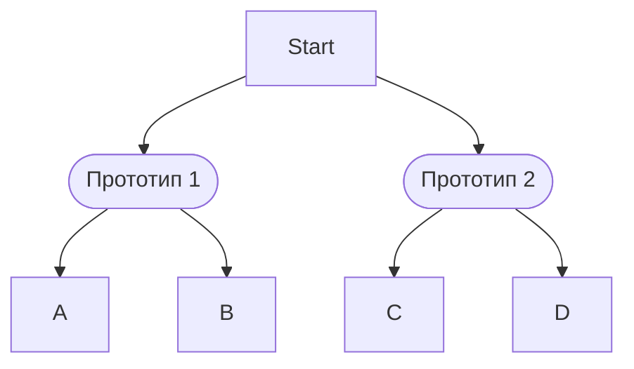
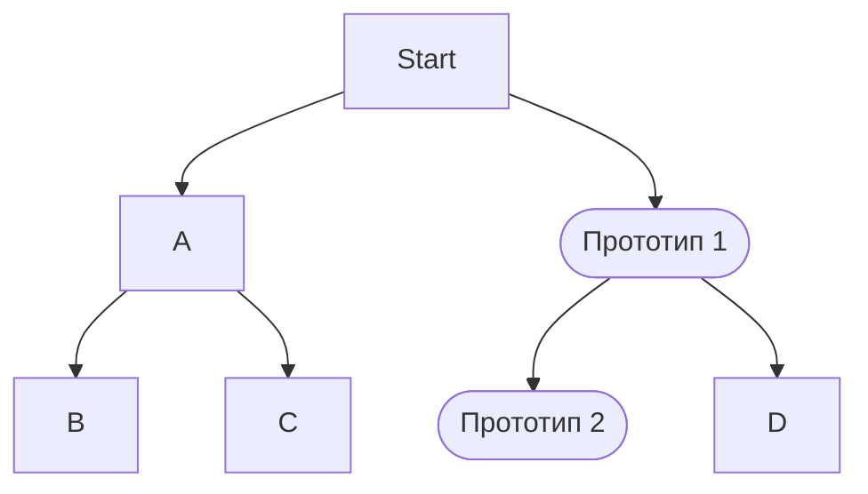
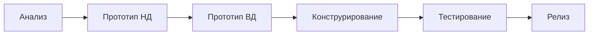
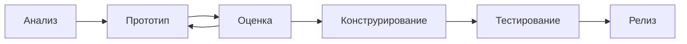
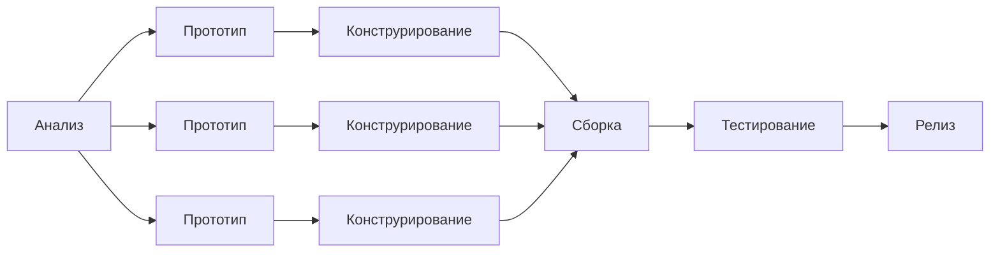
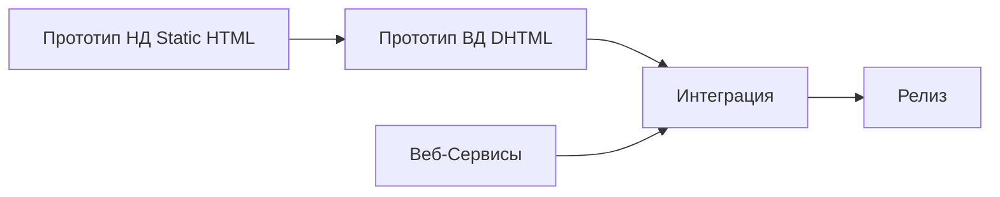

Совокупность возможностей методов взаимодействия двух систем

Человеко-машинный Интерфейс – это методы и средства обеспечения непосредственного взаимодействия между оператором и технической системой, предстовляющих возможности операторы уарвлять и контролировать его.

UI разновидность интерфейсов, представляют собой совокупность средств и методов при помощи которых пользователи взаимодействию с машинными устройствами и аппаратурой

Подходы:
- Инженерно-технический Machine-centered
- Когнитивный Human-centered

**GOMS** – Goals Operator Methods Selection rules

1. Дизайн ориентированный на деятельность – Рассматривает человек компьютер я комплекс связанных деятельностных понятий и представлений. Представляет комп в качестве инструмента для решения различных задачь, именно деятельность человека влияет на интерфейс.

Согласно принципам теории деятельности, весь поток активности пользователя можно разложить на последовательность логический такт.

2. Дизайн ориентированный на цель – понимание того к чему стремится пользователь.

**Когнетивное трение** – Это понятие введённое Аланом Купером и характеризующее отношения человека к сложной вещи например ПК как к другому человеку.

3. Дизайн ориентированный на пользователя – изучение потребностей пользователя.

**Правила создания интерфейсов:**

## 2 закона дизайна интерфейса:

Джеф Раскин The Human Interface

1. компьютер не должен вредить вашей работе или своим бездействием допустить причинение вреда вашей работе
2. Компьютер не должен тратить ваше время или требовать от вас больше работы чем необходимо

## 3 общих правила проектирования UI

Жаркоф в своей книге ShareWare: профессиональная разработка и продвижение программ:

1. Программа должна помогать выполнять задачу, а не становиться этой задачей.
2. При работе с программой пользователь не должен ощущать себя дураком.
3. Программа должна работать так, чтобы пользователь не считал програаму дураком

## 8 золотых правил Бена Шнейдермана

Designing the user interface

1) Будьте последовательны, используйте одинаковые действия в идентичных случаях
2) Учитывайте возможности опытных пользователей, представьте им альтернативные способы управления программой
3) Используйте обратную связь, программа должна реагировать на каждую операцию
4) Создавайте законченные диалоги. Сформулируйте последовательные действия оператора в логические группы с началом, серединой и концом. Поддерживать обратную связь.
5) Используйте простые обработки ошибки. Спроектировать так, чтобы пользователь не совершал серьёзных ошибок.
6) Обеспечьте простой механизм отмены действия. Уменьшает беспокойство пользователей.
7) Создать впечатление что пользователь управляет всеми процессами.
8) Уменьшить загрузку кратковременной памяти.

## 10 Эвристических правил Нилсона

В 1994 году АйБиЭм.

1) Видимость состояния системы
2) Соответствие между системой и реальным миром
3) Пользователь должен иметь контроль над системой, иметь возможность изменить состояние системы путём отмены или повтора операции
4) Последовательность и стандарты. Принцип последовательности – использование одних и тех же понятий и средств для отражения схожих образов и выполнение однотипных действий. Использование типовых.
5) Предубеждение ошибок. Чтобы минимизировать количество пользовательских ошибок, мы используем подсказки к: кнопкам, полям, формам. Стараемся рассказать, как взаимодействовать с тем или иным элементом. Предупреждаем пользователей о последствиях тех или иных критических действий с помощью диалогового окна.
6) Понимание лучше запоминание. Не нужно воплощать пользовательский сценарий таким образом, чтобы пользователю приходилось что-то вспоминать, особенно если информация была дана на предыдущем шаге или вообще на другой странице. Если единый процесс настраивается в разных частях системы, нужно на каждом шаге транслировать необходимую информацию на текущем экране. Желательно также минимизировать скролл на форме. Например, у нас есть виджеты «info», которые могут сразу рассказать ITSM-агенту о самых важных параметрах инцидента и предоставить контакты абонента, не заставляя переходить на карточку профиля.
7) Гибкость и эффективность использования. У каждого пользователя свой подход к взаимодействию с интерфейсом и свой индивидуальный опыт.
8) Эстетичный и минималистичный дизайн. Чем больше информации на экране, тем сложнее увидеть главное. Поэтому мы прячем второстепенную информацию в меню, за кнопками «help» и «info», за ссылками.
9) Распознавание и исправление ошибки.
10) Справки и документация. Документацией у нас занимается отдел технических писателей. В своих статьях они пошагово рассказывают о том, что представлено на экране и для чего конкретная сущность существует, как правильно настроить процессы, какие ошибки при этом могут случиться и как их исправить. Конечно, лучше всего минимизировать походы пользователя в документацию, что мы и делаем с помощью подсказок к полям и справочной информации на формах. Однако инструкция всегда должна быть у пользователя под рукой. Сейчас мы на пути к тому, чтобы специализировать нашу документацию по ролям, так как понимаем, что рядовым пользователям значительная часть инструкций не нужна, а вот разработчикам хотелось бы побыстрее добраться до описания специфичных настроек.

# Принцип User Centered Design

Ларри Констатин идеолог концепции дизайна, ориентированного на использование в книге Software to use 1999 году с Люси Локвуд. Представил следующие принципы при разработке интерактивных систем:

1. проектирование интерфейса должно вестись **целенаправленно** с использование конструктивных решений основанных на чётких и последовательных моделях, узнаваемых для пользователя. Структура может формироваться путём группировки связанных объектов и разделение не связанных
2. **Принцип простоты**
3. **Видимости**. Все элементы для решения конкретной задачи должны быть видны и не должно быть лишнее.
4. **Принцип обратной связи**. Дизайн должен информировать пользователей о выполняемом действиях, изменениях состояниях или условий, ошибках и исключениях. Информация должна быть актуальная интересна пользователю и представлена в чёткой и компактно и не в двусмысленной форме
5. **Принцип толерантности**. Дизайн должен быть гибким и терпимым к действиям пользователям, позволять отмену и повторное выполнение операций. Предотвращать ошибки где возможно, интерпретируя все входные последовательности в разумные действия. 

1992 Международная организация по стандартизации (International Organization for Standardization) предоставила группу стандартов **ISO 9241 "Эргономические требования для офисной работы с видео дисплейными терминалами". Ergonomics of human-system interaction**

В России имеются номинальные стандарты по эргономике часть и которых разработаны в 80-х годах 20 века, актуальны и сегодня. **ГОСТ 30.001-83**

Большинство документов аутентичны международным стандартам.

# Этапы разработки пользовательского интерфейса

## Фактор влияния

Дизайн пользовательского интерфейса является фактором оказывающее влияние на 3 основных показателя качества программного продукта.

1. **Функциональность** является фактором, на который разработчики приложений зачастую обращают основное внимание. Они пытаются создавать программу так, чтобы пользователи моглы выполнять свои задачи и им было удобно жто делать.
2. **Эстетический вид и способы его представления** вплоть до упаковки позволяет сформировать у потребителя положительное мнение о программе, но они условны и субъективны.
3. **Производительность и надёжность** также влияют на перспективу применения программы. Если хорошо выглядит, но кривой как Киберпанк 2077, у него будет мало шанса на длительную эксплуатацию. Но наоборот могут от части компенсировать его не самый стильный дизайн.

## Разработка интерфейса как процесс

От дизайнера требуется соблюдать баланс между перечисленными факторами на протяжении всего цикла разработки. Это всё достигается путём деталной разработки.

Этапы разработки:
1) Проектирование
	1) Функциональные требования (цель разработки, исходные требования)
	2) Концептуальное проектирование (моделирование процесса)
	3) Физическое проектирование
2) Реализация
	1) Прототипирование (макеты)
	2) Конструирование (возможность изменения в дизайне)
3) Тестирование

## Определение требований к разработке

1. Потребности отражают проблемы бизнеса персоналии или процесса, которые должны быть соотнесены с системой.
2. Группа функциональных задач. Часто представляются в виде сценария использования.

1) Бизнес требования описывают и определяют высокоуровневые цели организации или клиента.
2) Пользовательские требованя. Цели и задачи пользователей системы. Которые должны выполняться пользователями при помощи создаваемого программной системы. Эти требования часто представляют в виде вариантов использования.
3) Функциональные требования.  Функциональность (поведение) программной системы, которая должна быть создана разработчиками для предоставления возможности выполнения пользователями своих обязанностей в рамках бизнес-требований и в контексте пользовательских требований.
4) системные требования. Эти характеристики могут описывать требования как к аппаратному обеспечению (тип и частота процессора, объём оперативной памяти, объём жесткого диска), так и к программному окружению (операционная система, наличие установленных системных компонентов и сервисов и т. п.). Обычно такие требования составляются производителем или автором ПО.

3. Нефункциональные требования, соответственно, регламентируют внутренние и внешние условия или атрибуты функционирования системы:

1) Бизнес-правила. Связаны с политиками, регламентами, стандартами, законодательными актами.
2) Внешние интерфейсы. Это не только интерфейсы пользователя, но и протоколы взаимодействия с другими системами.
3) Атрибуты качества. Атрибуты касаются вопросов нормировости прозрачности взаимодействия с другими системами, целостности, устойчивости и т.п.
4) Ограничения формулировки условий, модифицирующих требования или наборы требований, сужая выбор возможных решений по их реализации. В частности, к ним могут относиться параметры производительности, влияющие на выбор платформы реализации и/или развертывания (протоколы, серверы приложений, баз данных и т.д.). Ограничения часто основываются на бизнес-правилах.
4. Системные требования иногда классифицируются как составная часть группы функциональных требований. Описывают высокоуровневые требования к программному обеспечению, содержащему несколько или много взаимосвязанных подсистем и приложений. При этом, система может быть как целиком программной, так и состоять из программной и аппаратной частей. В общем случае, частью системы может быть персонал, выполняющий определенные функции системы, например, авторизация выполнения определенных операций с использованием программно-аппаратных подсистем.

# Анализ пользователей, методы и средства
Расмотрим некоторые методы применяя на разных этапов разработки пользовательских интерфейсов.

1. **Персинификация** – Составление детализированных типовых профилей потенциальных пользователей относяшихся к разным группам. Анализ профилей позволяет смоделировать такие поведенческие аспекты, как цели, желания, потребности, предпочтения и ожидания пользователей. Это будет полезным при принятии решений, связанных с возможностями продукта, их визуальным представлением и способами интерактивного взаимодействия.
2. **Анализ контекста** использования состоит в сборе всей доступной информации о том, что именно делают пользователи в процессе выполнения конкретной задачи и в каком окружении они это делают. Это позволяет направить разработку интерфейса так, чтобы он наиболее полно соответствовал порядку работы пользователей с компонентами системы. Результаты анализа являются основой для составления _сценариев использования_ (Use Cases).
3. Сценарии использования (Use cases) Сценарии описывают поведение пользователей при решении производственных задач в определенном контексте. Они представляют примеры использования как отправную точку для проектирования, а также закладывают основу для юзабилити-тестирования.

Преимуществами использования сценариев является то, что они позволяют:

- моделировать поведение предполагаемых пользователей, их задачи и окружение;
- исследовать вопросы юзабилити на самых ранних этапах проектирования;
- определять цели пользователей и вероятное время, затрачиваемое ими для достижения этих целей;
- обойтись минимальными ресурсами;
- использовать сценарии для дальнейших оценочных исследований;
- уменьшить необходимость экспертизы человеческого фактора.

Алгоритм разработки пользовательских сценариев может быть представлен следующим образом:

1. Определение общего контекста, выделение потенциальных пользователей и их задач в этом контексте.
2. Функциональная декомпозиция пользовательских задач на последовательности операций, необходимых для их решения.
3. Разделение операций на те, которые должны выполняться пользователями и те, которые компьютером.
4. Непосредственное формирование сценариев в виде последовательности операций. При этом не следует выделять, что для решения определенных задач используются какие-то особенности продукта.
5. Дополнение сценариев оценками времени и критериями завершенности.

Основная сложность при использовании этого метода связана с осознанной необходимостью разработки такого количества сценариев, которое покрывало бы наибольшее количество различных ситуаций, а не только самых типичных или, например, интересных разработчикам. Наряду с последовательными, в список стоит включить и нелинейные сценарии, которые будут использованы при тестировании. В дальнейшем, для оценки разрабатываемой системы, должен использоваться полный набор сформированных сценариев.
### Сортировка карточек

Это простой, надежный и недорогой метод изучения пользователей, применяемый для деления информации на группы. Результаты сортировки (полученные группы) могут использоваться для структуризации приложения и, как следствие, формирования навигационной схемы (например, определение структуры меню веб-сайта).

Суть метода сортировки карточек сводится к следующему:

1. _Формирование списка материалов и тематик._ Для этого используются различные источники, начиная от материалов, используемых в имеющемся приложении (или в конкурирующих разработках) и вплоть до планируемых в будущих версиях. Включение будущих материалов, которые не предусмотрены в текущей разработке, позволит в дальнейшем сократить затраты, поскольку возможность расширения функциональности и представляемой информации уже будет спроектирована.
2. _Подбор участников._ Сортировка карточек может выполняться индивидуально или в группе. Для индивидуального тестирования потребуется с десяток добровольцев. Для группового тестирования рекомендуется сформировать не менее пяти групп по три человека в каждой. В обоих случаях главное то, что участники тестирования должны быть наиболее типичными представителями целевой аудитории.
3. _Подготовка карточек._ Тем или иным способом ранее отобранные материалы наносят на отдельные бумажные карточки. Подписи на карточках должны быть достаточно короткими, чтобы участники могли их быстро прочитать и в то же время достаточно подробными, чтобы участники могли понять о чем идет речь. Рекомендуется оставить несколько пустых карточек, куда участники тестирования смогут вписать свои предложения. Все карточки, в т.ч. и пустые, снабжаются уникальным идентификатором.
4. _Выполнение теста._ Перед началом теста карточки перемешивают, чистые карточки помещают рядом. Участники теста по одному (или по группам) заходят в комнату и раскладываю карточки так, как считают нужным, при необходимости — записывают свое видение в пустые карточки. Наблюдатель, постоянно присутствующий в комнате, фиксирует результаты сортировки, карточки снова перемешивают и приглашают следующего участника (группу).
5. _Анализ результатов._ Результаты тестов сводят в единую таблицу и уже по ней выявляют те самые пользовательские предпочтения, ради чего все это и затевалось. Здесь нет каких-либо точных инструкций, поскольку любой анализ есть «нечто среднее между магией и наукой».

|                      | Просто                                                         | Трудно                                                     |
| -------------------- | -------------------------------------------------------------- | ---------------------------------------------------------- |
| Размеры сайта        | Малый                                                          | Большой                                                    |
| Тип материалов       | Однородные (напр., каталог товаров, список услуг, блог и т.д.) | Разнородные (напр., портал, правительственный сайт и т.п.) |
| Сложность материалов | Участники разбираются в содержании большинства материалов      | Материалы требуют специфических или специальных знаний     |

### Анализ конкурентов
Дешёвый способ выявить сильные и слабы стороны ПО аналогичному проектированному но уже имеющиеся на рынке. небольшое время потраченное на ознакомление с несколькими наиболее популярными и представление о решениях. Результаты фиксируется в виде перечня вопросов которые предстоит решить чтобы обойти конкурентов. Также результаты применения этого метода может являться список возможностей, которые потребуются добавить в новый продукт.
### Диаграммы близости

Оригинальное название этого метода — _affinity diagramming_ — можно перевести как построение диаграммы тематического сходства/близости. Метод основан на сортировке карточек, но выполняется иначе: группировкой элементов занимаются представители разработчика и эксперты со стороны заказчика в ходе совместного обсуждения. Участникам представляется возможность реструктурировать элементы и/или группы, добавлять новые и удалять не нужные.
### Мозговой штурм

Широко используемый экспертный метод оперативного решения задач. Поиск решения выполняется в три этапа:

1. _Постановка задачи_. В ходе этого этапа проблема, подлежащая решению, должна быть четко сформулирована.
2. _Генерация идей_. Основной этап, на котором от участников требуется быстро предлагать различные, возможно даже абсурдные идеи решения задачи. На этом этапе исключены какие-либо оценки предлагаемых вариантов, поскольку здесь главное — их количество.
3. _Группировка, оценка и отбор идей_. Каждая из предложенных идей обсуждается и принимается решение о возможности ее дальнейшего использования.

Очень часто метод мозгового штурма применяют «внутри» других методов, например, в ходе проектирования структуры приложения методом affinity diagramming.
### Фокус-группы

Фокус-группа — это неформальное собрание пользователей, у которых запрашивается мнение по определенной теме. Цель в том, чтобы выявить чувства, восприятие, общее отношение и идеи участников обсуждения применительно к обсуждаемому вопросу. Метод фокус-групп применяется, в первую очередь, для сбора информации, но не для ее оценки, поэтому важно так начать дискуссию, чтобы пользователи перешли к активному обсуждению. Иначе, можно получить ответы не столько выражающие мнение участников, сколько ожидаемые организаторами. Фокус-группы часто применяются для тестирования ранее внедренной или внедряемой системы. Положительным аспектом этого метода является то, что в ходе обмена мнениями пользователи обучают друг друга.
### Дневники наблюдений

Высокоэффективная, но довольно сложная методика анализа пользователей, основанная на длительном по времени наблюдении за их действиями при работе с автоматизированной системой. Все действия фиксируются в виде дневниковых записей (в бумажном или электронном виде), в конце эксперимента производится анализ полученной информации. При достаточном объеме данных можно (и нужно) провести статистические исследования и получить количественные значения качественных показателей (например, через количество обращений к определенной операции оценить ее доступность через пользовательский интерфейс). Этот метод также подходит для анализа социальных связей и коммуникационных шаблонов внутри и между группами пользователей.

Сложности метода связаны, в основном, с нежеланием пользователей сотрудничать. Если дневник ведет наблюдатель-представитель разработчика, то он должен «слиться с фоном», поскольку мало кто из наблюдаемых любит, когда у него «стоят над душой». Если же дневник поручено вести самому пользователю, то часть информации он, скорее всего, «возьмет с потолка» (попробуйте проанализировать эту ситуацию самостоятельно).
### Прототипирование

Прототипирование (создание прототипа) выполняется на основании результатов ранее произведенных исследований. Это позволяет всем заинтересованным сторонам оценить глубину проработки проекта, сравнить альтернативные варианты с учетом мнения заинтересованных сторон и выбрать то решение, которое пойдет в дальнейшую разработку.
### Юзабилити-тестирование

Тестирование системы целевыми пользователями, которое может применяться на разных этапах ее создания. На ранних стадиях этот метод может быть применен в ходе анализа конкурирующих продуктов. При этом на пользователей возлагают задачи субъективной оценки и сопоставления предложений. Юзабилити-тестирование прототипов (в т.ч. и бумажных) позволяет оперативно и с меньшими затратами корректировать дизайн пользовательского интерфейса. При создании приложений, ориентированных на пользователей, юзабилити-тестирование входит в состав основного набора тестов, которые должны быть выполнены до передачи программного продукта в эксплуатацию.

### Средства

Существует довольно большое количество инструментов, используемых в различных методах анализа пользователей. Среди них как офф-лайновые решения (начиная с обычной бумаги), так и он-лайновые сервисы. В табл. 1 приведены некоторые примеры программ, используемых при разработке пользовательских интерфейсов.

***UXSort*** — Windows-приложение, позволяющее выполнять исследования, связанные с определением структуры методом сортировки карточек. Поддерживает до 1000 карточек, глубина сортировки — до 2-х уровней. Позволяет импортировать карточки из MS Excel или MS Word.

***Pencil Project (Evolus Pencil)*** Свободная программа для создания прототипов, доступая для всех платформ. Легка в установке и использовании. Имеет большое количество подключаемых наборов шаблонов. Поддерживает экспорт в форматы .html, .svg, .pdf, .odt, .png.

***GUI Machine*** — кроссплатформенный инструмент прототипирования интерфейсов десктопных и веб-приложений, позволяющий быстро и просто создавать высококачественные прототипы и просматривать их в интерактивном режиме. Содержит большое количество нативных и платформо-независимых компонентов.

***Moqups*** Веб-приложение для создания прототипа сайта или мобильного приложения. Является удобным онлайн-редактором, для начала работы с которым даже не требуется регистрация. Доступны как бесплатная версия, так и коммерческая, с расширенными возможностями.

# **Прототипирование и концептуальное проектирование**

**Создание прототипа — следующий шаг в разработке пользовательского интерфейса. Прототипирование позволяет создавать макеты интерфейсов разной степени достоверности: от набросков «на скорую руку» и бумажных прототипов до интерактивных макетов с использование специальных программ.**

_Глобальные прототипы_ моделируют систему целиком. Их использование позволяет выявлять проблемы, связанные с _полнотой_ и _непротиворечивостью_ пользовательского интерфейса.

_Локальные прототипы_ моделируют только небольшую часть системы. Они могут быть использованы для устранения разногласий во мнениях через сопоставление различных вариантов дизайна: достаточно сделать несколько альтернатив и оценить их.

Два вида локальных прототипов, _горизонтальные_ и _вертикальные_, направлены на полноту функциональности и диапазон возможностей в прототипе. Горизонтальные прототипы имеют небольшую функциональную глубину, но широки в возможностях. Вертикальные прототипы функционально глубоки, но ограничены в возможностях. Для лучшего понимания приведем две диаграммы, иллюстрирующме отличия горизонтального и вертикального прототипов для некоторой структуры приложения.

***Горизонтальный***

***Вертикальное***

### Достоверность

Все прототипы можно разделить на прототипы низкой достоверности и прототипы высокой достоверности.

Первые, как правило, мало похожи на окончательный продукт. Они делаются не из того же самого материала, что и окончательное устрid1((Some text))
ойство и не имеют всей его функциональности. Прототип низкой достоверности может симулировать некоторую интерактивность, но не отражает всех тонкостей взаимодействия.

Вторые, напротив, выглядят более похожими на законченное устройство. Окончательный, утвержденный дизайн — пример прототипа высокой достоверности. Он может иметь некоторые из функций завершенного продукта и позволяет протестировать больше тонкостей взаимодействия. При этом, он требует больше времени на разработку и создание. Зачастую, после создания действующего прототипа высокой достоверности команда разработчиков или менеджеров неохотно отказывается от него и пытается развить из прообраза законченное устройство. В этом есть минус — такой подход может вести к ограниченному прогрессу в дизайне.

Преимущества и недостатки прототипов разной степени достоверности

| Достоверность прототипа | Преимущества                                                                                                                                                                                                                                                                                                              | Недостатки                                                                                                                                                                                                                                                                                                           |
| ----------------------- | ------------------------------------------------------------------------------------------------------------------------------------------------------------------------------------------------------------------------------------------------------------------------------------------------------------------------- | -------------------------------------------------------------------------------------------------------------------------------------------------------------------------------------------------------------------------------------------------------------------------------------------------------------------- |
| Низкая                  | - Меньшая стоимость разработки - Возможность оценки множества вариантов дизайнов - Представляет полезную информацию для разработчиков и дизайнеров - Решает проблемы создания макетов экрана - Моет использоваться для определения потребностей рынка - Доказывает или опровергает идеи и концепции        | - Ограниченный контроль ошибок - Плохая детализация спецификаций для дальнейшей разработки - Процессом управляет «посредник» - Ограниченная полезность после утверждения требований - Ограниченная пригодность для юзабилити-тестирования - Ограничения, связанные с навигацией и потоками активности |
| Высокая                 | - (Почти) полная функциональность - Интерактивность - Процесс разработки, управляемый пользователем - Четкая навигационная схема - Является инструментом для исследования и тестирования - Наглядно показывает конечный продукт - Служит «живой» спецификацией - Маркетинговый и торговый инструмент | - Высокая стоимость разработки - БОльшие затраты времени на создание - Не эффективен для проверки идей и концепций - Не эффективен для формирования окончательных требований                                                                                                                                |

До начала создания прототипа высокой достоверности убедитесь, что ваш дизайн хорош, создав несколько прототипов низкой достоверности. Они могут принимать разные формы и каждая из них позволяет подтвердить или проверить различные аспекты дизайна.
## Прототипирование

Под прототипированием следует понимать ничто иное, как процесс создания прототипа. Хикс и Хартсон (Developing User Interfaces: Ensuring Usability through Product and Process, Wiley, 1993) описывают прототипирование по аналогии с артиллерийской стрельбой: артиллеристы наводят орудие в общем направлении на мишень; следует выстрел; корректировщики оценивают попадание (или промах) и радируют о необходимости корректировки прицела; после регулировки делается следующий выстрел. Так же и прототипирование: чтобы протестировать дизайнерскую идею (попадание или промах) нужно создать и оценить прототип.
### Виды прототипирования

Традиционный подход к разработке макета пользовательского интерфейса основан на переходе от прототипа низкой достоверности к прототипу высокой достоверности (рис. 2). На практике, эта простая и логичная схема выливается в более совершенную технологию _эволюционного прототипирования_.

**Эволюционное прототипирование** предполагает последовательное увеличение достоверности исходного образца, пока, в конце концов, он не становится законченной системой. Эволюционное прототипирование — широко распространенный подход к разработке интерфейсов, но он таит некоторую опасность: если изначально создается прототип высокой достоверности, его сложно будет расширять для проверки новых идей. Несмотря на это, эволюционное прототипирование может быть полезным для выявления все больших и больших тонкостей в аспектах дизайна и его совершенствования.

**Быстрое прототипирование** подразумевает, что серии прототипов создаются, а затем, после их оценки и принятия решения о неадекватности модели, отбрасываются. Обычно разрабатываются прототипы все более и более высокой достоверности. Быстрое прототипирование может быть сложным для проектирования командой разработчиков или для приемки менеджерами, потому что выглядит так, как если бы время затраченное на разработку прототипа было потрачено впустую.

**Инкрементное прототипирование** основано на сборке окончательного продукта из нескольких прототипов. Все части (отдельные прототипы) могут разрабатываться параллельно, тем самым сокращая общее время на разработку.

**Экстремальное прототипирование** используется при создании веб-приложений. Весь процесс разбивается на три фазы. В первой фазе создается прототип низкой достоверности, состоящий из статических веб-страниц. Во второй фазе создается работоспособный код веб-приложения, а статические веб-страницы переписываются с учетом используемого фреймворка и функциональности, создается полностью работоспособный на уровне модели пользовательский интерфейс. В третьей фазе выполняется интеграция веб-интерфейса со всеми сервисами и ресурсами.

## Разработка прототипа: от теории к практике

### Бумажное прототипирование

Вы имеете всего лишь несколько дней, оставшихся до представления ваших идей относительно приложения. Нет времени на создание полной модели (которая, на самом деле, есть другой прототип). Что вы можете сделать? Вы можете создать **бумажный прототип.**

Все, что вам потребуется для создания бумажного прототипа:
- картон, линованная и нелинованная бумага, разноцветная бумага для заметок, листы прозрачной ацетатной пленки;
- цветные ручки, фломастеры и карандаши;
- канцелярский клей, клейкая лента, клей многократного применения (подобный тому, который наносится на клейкие заметк);
- ножницы, канцелярский нож, хорошая линейка, циркуль.

В своей книге о проектировании веб-сайтов, Д. МакКракен и Р. Вольф предлагают в качестве основы для прототипа всех страниц сайта использовать распечатанный на плотной бумаге скриншот окна браузера. Они же предлагают делать все, что изменяется или исчезает на сайте (панели меню, полосы прокрутки, выпадающие меню) из бумаги. В Интернете есть множество готовых шаблонов указанных элементов, которые нужно просто скачать, распечатать, вырезать и использовать. Затем вырезанные из бумаги элементы страницы нужно разместить на шаблоне. По-разному компануя элементы макета или заменяя их на другие, вы, в конце концов, найдете подходящий вариант дизайна. Чтобы зафиксировать его, вы можете отсканировать полученные макеты или сфотографировать их.

Этот прототип позволяет моделировать интерактивность путем перемещения, удаления и размещения различных элементов на шаблоне.

МакКракен и Вольф предлагают установку крайнего срока для изготовления прототипа, потому что многие участники команды разработчиков постоянно будут предлагать какие-нибудь усовершенствования в ходе работы над моделью. Это творческое усердие дизайнеров может длиться вечно, пока у них будут идеи, которые могут быть проверены.
### Раскадровки

Раскадровка — это последовательность зарисовок, показывающих, как пользователь продвигается «сквозь» задачу, используя конкретное устройство. Это могут быть эскизы графического пользовательского интерфейса (GUI) или наброски сцен пользовательского взаимодействия с программой или устройством. Раскадровки очень хороши для оживления сценариев взаимодействия.

Можно думать о раскадровке, как о совокупности пиктограмм, каждая из которых обозначает объект или действие. Ни что не мешает вам нарисовать пользователя в виде фигурки из черточек, а компьютер — в виде прямоугольника.

Если вы используете для раскадровки какой-нибудь графический редактор, типа «GIMP» или «Photoshop», то очень важно не поддаться соблазну сделать ваш макет идеальным. Помните, дело не в том, чтобы получить красивую картинку, но в том, чтобы приблизить изображение интерфейса настолько хорошо, чтобы его хватило для дальнейшей работы над прототипом.
## Разновидности прототипов

|Тип|Описание|
|---|---|
|Раскадровка|Наброски или снимки экрана, иллюстрирующие ключевые точки в описаниии использования|
|Картонный макет|Образец устройства с имитацией управления или экранных элементов. Выполняется не обязательно из картона.|
|«Волшебник Оз»|Рабочая станция, связанная с невидимым человеком-асситентом, который симулирует ввод, вывод и исполняемую функциональность, которая еще не доступна|
|Видео-прототип|Видеозапись людей, разыгрывающих одну или несколько предполагаемых задач|
|Компьютерная анимация|Переходы экранов, которые иллюстрируют последовательности входных и выходных событий|
|«Машина сценариев»|Интерактивная система, реализующая определенный поток событий сценария|
|Быстрый прототип|Интерактивная система, созданная с помощью специальных инструментов прототипирования (в частности, с помощью визуальных средств разработки)|
|Частично работающая система|Исполнимая версия системы с ограниченной функциональностью|
## Концептуальный проект

В промышленности концептуальный проект понимается как специфичный документ, отражающий интегрированные идеи, описывающие систему: ее функции, внешний вид и порядок взаимодействия с пользователем. Но дизайнеры часто вкладывают в понятие концептуального проекта несколько иной смысл, подразумевающий идею системы в целом.

Прис, Роджерс и Шарп в своей книге о пректировании взаимодействия предполагают, что концепция может быть основана на трех перспективах:

- **Деятельность** — действия, которые пользователи выполняют чаще всего, в терминах четырех парадигм:
    - указание инструкций (как в большинстве программ: пользователь указывает системе, что она должна делать, задавая нужные команды через меню или прямым вводом);
    - общение с системой (диалоговый режим);
    - манипуляция и навигация по системе;
    - исследование и просмотр;
- **Объекты** — продукты интерфейса (отображаемые результаты) или объекты, используемые в интефейсе.
- **Метафоры** — аналоги объектов или процессов реального мира.

Хороший концептуальный проект базируется на этих трех перспективах. Это можно проиллюстрировать примером. Один из наиболее востребованных видов офисных приложений — редакторы таблиц. Первый табличный редактор, VisiCalc, спроектировал Дэн Бриклин. До появления табличных процессоров, бухгалтеры вели учет, используя бухгалтерские книги и выполняя вычисления вручную. Бриклин понял, что бухгалтеры имеют проблемы с существующими инструментами, что компьютеры могут сделать процесс более производительным и интерактивным. Концептуальный проект будущего программного продукта был таким:

1. табличный процессор должен напоминать раскрытую бухгалтерскую книгу,
2. должна быть возможность редактировать содержимое ячеек таблиц,
3. должна быть возможность выполнять вычисления для диапазонов ячеек.

Его концептуальный дизайн учитывал деятельность (вычисления над данными, представленными в табличном виде), объекты (общие записи, ячейки, колонки) и имел хорошую метафору.

# Метафоры 

**Метафоры** очень полезны в проектировании. Они связывают новый продукт с его предшественником. Они делают продукт более легким в освоении и использовании. Они могут помочь проектировщику в создании более согласованного дизайна интерфейса и выборе проектных альтернатив. Однако, метафора — прочная концепция и это может быть опасно. Пользователи могут верить в то, что новая система должна работать идентично аналогичной системе, с которой они уже знакомы и будут озадачены, если это окажется не так. Также проектировщики могут слишком сильно придерживаться метафоры, что может быть причиной плохого дизайна. Пример, иллюстрирующий и то, и другое: первые текстовые редакторы. В их основе — метафора с печатной машинкой: курсор, в виде символа подчеркивания или серого квадрата, отождествлялся с кареткой пишущей машинки. Пользователи, имевшие некоторый опыт работы с печатной машинкой, могли довольно быстро освоить текстовый редактор. Однако, у них часто возникали сложности с впечатыванием символов в пустые области или поверх пробелов. Метафора с печатной машинкой подсказывала им, что нужно поместить курсор в нужное, визуально не занятое какими-либо символами, место, чтобы напечатать там символ. Это то, что сделала бы печатная машинка, и это называлось «перевести каретку». Пользователи не могли осознать, что символ пробела — это такой же символ, как и другие. Так дизайнеры слишком сильно придерживались аналогии. Сам курсор в виде знака подчеркивания («_») еще больше усиливал непонимание. Позже курсоры стали вертикальными линиями и это сделало понятней различие между метафорой и приложением. В данном примере все могло быть еще хуже: дизайнеры могли бы перемещать страницу вслед за вводом текста. Понимание того, что страница должна оставаться неподвижной позволило упростить создание текстовых документов, но, заметьте, пишущая машинка функционирует иначе. Здесь есть две морали:

- Подыщите хорошую метафору, но не придерживайтесь ее слишком сильно, делайте четкое различие.
- Попробуйте найти направления, в которых дизайн может улучшить старые способы ведения дел.

# Закон Фитса и Хика

Представим, что вы перемещаете курсор к кнопке, изображенной на экране. Кнопка является _целью_ данного перемещения. Длина прямой линии, соединяющей начальную позицию курсора и ближайшую точку целевого объекта, определяется в законе Фитса как _дистанция_. На основе данных о размерах объекта и дистанции **закон Фитса** позволяет найти среднее время, за которое пользователь сможет переместить курсор к кнопке.

В одномерном случае, при котором размер объекта вдоль линии перемещения курсора обозначается как _S_, а дистанция от начальной позиции курсора до объекта — как _D_ (рис. 4.6), закон Фитса формулируется следующим образом:

T = a + b \ log_2(D/S+1)

![[Pasted image 20241120154214.png]]

Ширина цели может быть бесконечной (в одном измерении), если кнопка вплотную прилегает к стороне экрана, а курсор манипулятора (мыши) останавливается у края автоматически.

Угол является ещё проще, так как бесконечна в 2 измерения. 

Контекстное меню, особенно в некоторых компьютерных играх, радиальное, сокращает расстояние до цели, тем самым уменьшая время затрачиваемое на совершения действия.

1954 году был опубликован Поллом Фитсом.

Это согласуется с данными полученными в экспериментах со структурами меню.

Время реакции возрастает как линейная функция количества информации (измеренной в битах). закон Хика – Хаймана

Его матем. формулировка имеет вид T = a + b * H

Где T – время реакции, a и b – константы, а H – количество информации (измеряемые в битах).

# Компьютерная графика

Под компьютерной графикой понимают автоматизацию процесс подготовки преобразования хранения и воспроизведение графической информации с помощью компьютера

Свет называется ***ахроматическим*** если он содержит все видимые виды волн приблизительно в равных количествах. Отражённый или приломлённый ахроматический цвет кажется белым, серым или чёрным. Белыми выглядят объекты, ахроматически отражающие более 80% света белого источника, а черными - менее 3%. Промежуточные значения дают различные оттенки серого.

Если воспринимаемый свет содержит длины волн в произвольных неравных количествах, то он называется ***хроматическим***. Если длины волн сконцентрированы у верхнего края видимого спектра, то свет кажется красным или красноватым, т. е. доминирующая длина волны лежит в красной области видимого спектра. Если длины волн сконцентрированы в нижней части видимого спектра, то свет кажется синим или голубоватым, т. е. доминирующая длина волны лежит в синей части спектра. Однако сама по себе электромагнитная энергия определенной длины волны не имеет никакого цвета. Ощущение цвета возникает в результате преобразования физических явлений в глазу и мозге человека. Цвет объекта зависит от распределения длин волн источника света и от физических свойств объекта. Объект кажется цветным, если он отражает или пропускает свет лишь в узком диапазоне длин волн и поглощает все остальные. При взаимодействии цветов падающего и отраженного или пропущенного света могут получиться самые неожиданные результаты. Например, при отражении зеленого света от белого объекта и свет, и объект кажутся зелеными, а если зеленым светом освещается красный объект, то он будет черным, так как от него свет вообще не отражается.

Психофизическими эквивалентами цветового тона, насыщенности и светлоты являются доминирующая длина волны, чистота и яркость. Электромагнитная энергия одной длины волны в видимом спектре дает монохроматический цвет. Обычно встречаются не чистые монохроматические цвета, а их смеси. В основе трехкомпонентной теории света служит предположение о том, что в центральной части сетчатки находятся три типа чувствительных к цвету колбочек. Первый воспринимает длины волн, лежащие в середине видимого спектра, т. е. зеленый цвет; второй - длины волн у верхнего края видимого спектра, т. е. красный цвет; третий - короткие волны нижней части спектра, т. е. синий. Относительная чувствительность глаза максимальна для зеленого цвета и минимальна для синего. Если на все три типа колбочек воздействует одинаковый уровень энергетической яркости (энергия в единицу времени), то свет кажется белым. Естественный белый свет содержит все длины волн видимого спектра; однако ощущение белого света можно получить, смешивая любые три цвета, если ни один из них не является линейной комбинацией двух других. Это возможно благодаря физиологическим особенностям глаза, содержащего три типа колбочек. Такие три цвета называются основными.

### Законы Грассмана
- глаз реагирует на три различных стимула, что подтверждает трехмерность природы цвета. В качестве стимулов можно рассматривать, например, доминирующую длину волны (цветовой фон), чистоту (насыщенность) и яркость (светлоту) или красный, зеленый и синий цвета;
- четыре цвета всегда линейно зависимы, то есть cC = rR + gG + bB, где c, r, g, b <> 0. Следовательно, для смеси двух цветов (cC)1 и (cC)2 имеет место равенство (cC)1 + (cC)2 = (rR)1 + (rR)2 + (gG)1 + (gG)2 - (bB)1 + (bВ)2. Если цвет C1 равен цвету C и цвет C2 равен цвету C, то цвет C1 равен цвету C2 независимо от структуры спектров энергии C, C1, C2;
- если в смеси трех цветов один непрерывно изменяется, а другие остаются постоянными, то цвет смеси будет меняться непрерывно, то есть трехмерное цветовое пространство непрерывно.

# OpenGL

OpenGL расшифровывается как Open Graphics Library, что в переводе на русский язык означает «открытая графическая библиотека». Другими словами, OpenGL - это некая спецификация, включающая в себя несколько сотен функций. Она определяет независимый от языка программирования кросс-платформенный программный интерфейс, с помощью которого программист может создавать приложения, использующие двухмерную и трехмерную компьютерную графику. Первая базовая версия OpenGL появилась в 1992 году – она была разработана компанией Silicon Graphics Inc., занимающейся разработками в области трехмерной компьютерной графики.  

Функции OpenGL реализованы в модели клиент-сервер. Приложение выступает в роли клиента – оно вырабатывает команды, а сервер OpenGL интерпретирует и выполняет их. Сам сервер может находиться как на том же компьютере, на котором находится клиент (например, в виде динамически загружаемой библиотеки – DLL), так и на другом (при этом может быть использован специальный протокол передачи данных между машинами).

GL обрабатывает и рисует в буфере кадра графические _примитивы_ с учетом некоторого числа выбранных режимов. Каждый примитив – это точка, отрезок, многоугольник и т.д. Каждый режим может быть изменен независимо от других. Определение примитивов, выбор режимов и другие операции описываются с помощью _команд_ в форме вызовов функций прикладной библиотеки.

Примитивы определяются набором из одной или более _вершин_ (vertex). Вершина определяет точку, конец отрезка или угол многоугольника. С каждой вершиной ассоциируются некоторые данные (координаты, цвет, нормаль, текстурные координаты и т.д.), называемые _атрибутами_. В подавляющем большинстве случаев каждая вершина обрабатывается независимо от других.

С точки зрения архитектуры графическая система OpenGL является конвейером, состоящим из нескольких последовательных этапов обработки графических данных.

Команды OpenGL всегда обрабатываются в том порядке, в котором они поступают, хотя могут происходить задержки перед тем, как проявится эффект от их выполнения. В большинстве случаев OpenGL предоставляет непосредственный интерфейс, т.е. определение объекта вызывает его визуализацию в буфере кадра.

OpenGL является прослойкой между аппаратурой и пользовательским уровнем, что позволяет предоставлять единый интерфейс на разных платформах, используя возможности аппаратной поддержки.

Кроме того, OpenGL можно рассматривать как конечный автомат, состояние которого определяется множеством значений специальных переменных и значениями текущей нормали, цвета, координат текстуры и других атрибутов и признаков. Вся эта информация будет использована при поступлении в графическую систему координат вершины для построения фигуры, в которую она входит. Смена состояний происходит с помощью команд, которые оформляются как вызовы функций.

### Синтаксис команд

Определения команд GL находятся в файле gl.h, для включения которого нужно написать

|   |
|---|
|#include <gl/gl.h>|

Для работы с библиотекой GLU нужно аналогично включить файл glu.h. Версии этих библиотек, как правило, включаются в дистрибутивы систем программирования, например Microsoft Visual C++ или Borland C++ 5.02.

В отличие от стандартных библиотек, пакет GLUT нужно инсталлировать и подключать отдельно. Подробная информация о настройке сред программирования для работы с OpenGL дана в Приложении С.

Все команды (процедуры и функции) библиотеки GL начинаются с префикса gl, все константы – с префикса GL_. Соответствующие команды и константы библиотек GLU и GLUT аналогично имеют префиксы glu (GLU_) и glut (GLUT_)

Кроме того, в имена команд входят суффиксы, несущие информацию о числе и типе передаваемых параметров. В OpenGL полное имя команды имеет вид:

|   |
|---|
|type **glCommand_name[1 2 3 4][b s i f d ub us ui][v]**                    (type1 arg1,…,typeN argN)|

Таким образом, имя состоит из нескольких частей:

|   |   |
|---|---|
|**Gl**|это имя библиотеки, в которой описана эта функция: для базовых функций OpenGL, функций из библиотек GLU, GLUT, GLAUX это gl, glu, glut, glaux соответственно|
|**Command_name**|имя команды|
|**[1 2 3 4]**|число аргументов команды|
|**[b s i f d ub us ui]**|тип аргумента: символ b означает тип GLbyte (аналог char в С\С++), символ f – тип GLfloat (аналог float), символ i – тип GLint (аналог int) и так далее. Полный список типов и их описание можно посмотреть в файле gl.h|
|**[v]**|наличие этого символа показывает, что в качестве параметров функции используется указатель на массив значений|

Символы в квадратных скобках в некоторых названиях не используются. Например, команда glVertex2i() описана как базовая в библиотеке OpenGL, и использует в качестве параметров два целых числа, а команда glColor3fv() использует в качестве параметра указатель на массив из трех вещественных чисел.

Использования нескольких вариантов каждой команды можно частично избежать, применяя перегрузку функций языка C++. Но интерфейс OpenGL не рассчитан на конкретный язык программирования, и, следовательно, должен быть максимально универсален.

# Положение вершины в пространстве

Положение вершины определяются заданием ее координат в двух-, трех-, или четырехмерном пространстве (однородные координаты). Это реализуется с помощью нескольких вариантов команды glVertex*:

|                                                                                                              |
| ------------------------------------------------------------------------------------------------------------ |
| void **glVertex\[2 3 4]\[s i f d]** (type _coords_) void **glVertex\[2 3 4]\[s i f d]v** (type *_coords_) |

Каждая команда задает четыре координаты вершины: x, y, z, w. Команда glVertex2* получает значения x и y. Координата z в таком случае устанавливается по умолчанию равной 0, координата w – равной 1. Vertex3* получает координаты x, y, z и заносит в координату w значение 1. Vertex4* позволяет задать все четыре координаты.

Для ассоциации с вершинами цветов, нормалей и текстурных координат используются текущие значения соответствующих данных, что отвечает организации OpenGL как конечного автомата. Эти значения могут быть изменены в любой момент с помощью вызова соответствующих команд.

#### Цвет вершины

Для задания текущего цвета вершины используются команды :

|                                                                                                                   |
| ----------------------------------------------------------------------------------------------------------------- |
| void **glColor\[3 4]\[b s i f]** (GLtype _components_) void **glColor\[3 4]\[b s i f]v** (GLtype _components_) |

Первые три параметра задают R, G, B компоненты цвета, а последний параметр определяет коэффициент непрозрачности (так называемая альфа-компонента). Если в названии команды указан тип ‘f’ (float), то значения всех параметров должны принадлежать отрезку \[0,1], при этом по умолчанию значение альфа-компоненты устанавливается равным 1.0, что соответствует полной непрозрачности. Тип ‘ub’ (unsigned byte) подразумевает, что значения должны лежать в отрезке \[0,255].

Вершинам можно назначать различные цвета, и, если включен соответствующий режим, то будет проводиться линейная интерполяция цветов по поверхности примитива.

Для управления режимом интерполяции используется команда

|   |
|---|
|void **glShadeModel** (GLenum  _mode_)|

вызов которой с параметром **GL_SMOOTH** включает интерполяцию (установка по умолчанию), а с **GL_FLAT** – отключает.

#### Нормаль

Определить нормаль в вершине можно, используя команды

|   |
|---|
|void **glNormal3[b s i f d]** (type _coords_)  void **glNormal3[b s i f d]v** (type _coords_)|

Для правильного расчета освещения необходимо, чтобы вектор нормали имел единичную длину. Командой glEnable(GL_NORMALIZE)можно включить специальный режим, при котором задаваемые нормали будут нормироваться автоматически.

Режим автоматической нормализации должен быть включен, если приложение использует модельные преобразования растяжения/сжатия, так как в этом случае длина нормалей изменяется при умножении на модельно-видовую матрицу.

Однако применение этого режима уменьшает скорость работы механизма визуализации OpenGL, так как нормализация векторов имеет заметную вычислительную сложность (взятие квадратного корня и т.п.). Поэтому лучше сразу задавать единичные нормали.

Отметим, что команды

|   |
|---|
|void **glEnable** (GLenum _mode_) void **glDisable** (GLenum _mode_)|

производят включение и отключение того или иного режима работы конвейера OpenGL. Эти команды применяются достаточно часто, и их возможные параметры будут рассматриваться в каждом конкретном случае.

### Операторные скобки glBegin / glEnd

Мы рассмотрели задание атрибутов одной вершины. Однако, чтобы задать атрибуты графического примитива, одних координат вершин недостаточно. Эти вершины надо объединить в одно целое, определив необходимые свойства. Для этого в OpenGL используются так называемые операторные скобки, являющиеся вызовами специальных команд OpenGL Определение примитива или последовательности примитивов происходит между вызовами команд

|   |
|---|
|void **glBegin** (GLenum _mode_); void **glEnd** (void);|

Параметр _mode_ определяет тип примитива, который задается внутри и может принимать следующие значения:

|   |   |
|---|---|
|**GL_POINTS**|каждая вершина задает координаты некоторой точки.|
|**GL_LINES**|каждая отдельная пара вершин определяет отрезок; если задано нечетное число вершин, то последняя вершина игнорируется.|
|**GL_LINE_STRIP**|каждая следующая вершина задает отрезок вместе с предыдущей.|
|**GL_LINE_LOOP**|отличие от предыдущего примитива только в том, что последний отрезок определяется последней и первой вершиной, образуя замкнутую ломаную.|
|**GL_TRIANGLES**|каждая отдельная тройка вершин определяет треугольник; если задано не кратное трем число вершин, то последние вершины игнорируются.|
|**GL_TRIANGLE_STRIP**|каждая следующая вершина задает треугольник вместе с двумя предыдущими.|
|**GL_TRIANGLE_FAN**|треугольники задаются первой и каждой следующей парой вершин (пары не пересекаются).|
|**GL_QUADS**|каждая отдельная четверка вершин определяет четырехугольник; если задано не кратное четырем число вершин, то последние вершины игнорируются.|
|**GL_QUAD_STRIP**|четырехугольник с номером n определяется вершинами с номерами 2n-1, 2n, 2n+2, 2n+1.|
|**GL_POLYGON**|последовательно задаются вершины выпуклого многоугольника.|

